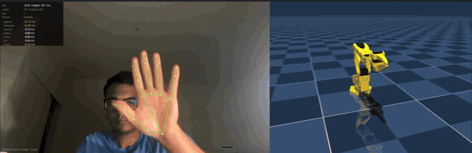

# robo_mimic

**Your hand moves. The arm mirrors it.**

Webcam hand-pose teleoperation for the [SO-101](https://github.com/TheRobotStudio/SO-ARM100).
One RGB camera. No depth sensor, no gloves, no markers.

[](docs/media/teleop.mp4)

**Left:** the camera, the 21 landmarks, and the live HUD — fps, clutch state, jaw
openness, tool position in cm, per-stage latency. **Right:** the SO-101 in MuJoCo,
following. Real time, unedited, one webcam. [Full 25 s clip](docs/media/teleop.mp4).

Built by [Φ — Physical Hardware Intelligence](https://github.com/physical-hardware-intelligence/phi).

> **Phase 6 of 7.** Live hand → simulated arm. Hardware is next.
> `make check` = **218 tests**, no camera required.

---

## Run it

```bash
make setup     # venv off exFAT, exact versions from uv.lock
make doctor    # deps, model, camera permission, pipeline -- one line each
make model     # fetch the SO-101 model, hash-pinned (16.4 MB of meshes)
make teleop    # LIVE: your hand on the left, the simulated arm on the right
```

**`SPACE` is the clutch — nothing moves until it is ON.** Then move your hand to
move the tool, **pinch to close the jaw, spread to open it**. `R` resets, `Q` quits.

| signal | drives | why |
|---|---|---|
| held key | the clutch | a key cannot false-trigger; a gesture threshold can. **Deadman, not UX** |
| hand position | tool position | incremental from wherever you engaged |
| thumb–index gap | **jaw opening**, continuous | the natural grasp gesture, and the jaw is **exactly** decoupled from the arm |
| hand rotation | tool rotation — **off** | only 7–37% of pitches are reachable on a 5-DOF arm |

**The jaw is gated by the clutch too.** A deadman that still lets the gripper
crush is not a deadman.

No camera? The same loop runs without one:

```bash
make bench     # per-stage latency budget, no camera, no window
make sim       # tracking error against a known trajectory
```

---

## Two facts that shape everything

### 1. One camera cannot tell you *where* a hand is

MediaPipe reports hand-**relative** geometry only. `hand_world_landmarks` are
metres about the hand's own palm centre; normalized `z` is relative to the wrist.
**Both origins sit on the hand.** Neither says how far away it is.

So orientation maps absolutely, and **position is incremental, through a
clutch** — pinch, move, release, like lifting a mouse off the desk. That
sidesteps the depth problem instead of approximating it, and cancels hand size
for free. → [ADR-002](docs/adr/002-incremental-position-clutch.md)

### 2. The arm has five degrees of freedom. A pose has six.

The whole constraint is **one scalar equation**:

```
â · n̂ = 0     â = the tool's x-axis (the wrist/roll axis)
              n̂ = the arm-plane normal
```

The tool's x-axis *is* the roll axis and it never leaves the arm's plane. So the
rotation you cannot have is about `ĉ = n̂ × â`, and `project.py` **reports** what
it discarded rather than swallowing it.

> Move your hand anywhere: the arm follows. Tilt it, twist it: the arm follows.
> **Tilt the gripper out of the arm's plane: nothing happens.**

→ [ADR-001](docs/adr/001-five-dof-projection.md)

---

## Architecture

Everything between the two ends is a **pure function**. That is why the suite
runs in CI with no camera and no arm.

```
 camera ──► landmarks ──► hand frame ──► retarget ──► project ──► safety ──► sim
[impure]   [mediapipe]     [pure]        [pure]       [pure]      [pure]   [impure]
              │                                          │           │
         version-pinned;                        the 5-DOF drop   the fuzz target
         its OUTPUT is the fixture               lives here      (30k frames, 0 escapes)
```

Fixtures store MediaPipe's **output**, not its input, so every downstream stage
is deterministic without a 60 MB native dependency.

## Phases

Each exits on a **committed number**, not on "it works".

| # | phase | gate |
|---|---|---|
| **0** ✅ | scaffold, kinematics, limits | `make check` green, real tests, ADRs written |
| **1** ✅ | perception | bit-identical landmarks, PNG-pinned. [→](docs/measurements/phase-1-perception.md) |
| **2** ✅ | hand frame + clutch + gripper | orthonormal to **1e-16**; mirror test exact. [→](docs/measurements/phase-2-handframe.md) |
| **3** ✅ | the 5-DOF projection | residual confined to one axis; round trip **5.96e-16 m**. [→](docs/measurements/phase-3-projection.md) |
| **4** ◐ | safety envelope | **30 000 adversarial frames, 0 escapes**. Hardware caps unverified. [→](docs/measurements/phase-4-safety.md) |
| **5** ✅ | sim in the loop | tool tracking **0.442 mm p95**; interpolation beats the staircase **13.3×**. [→](docs/measurements/phase-5-sim.md) |
| **6** ✅ | live | **13–20 fps** real use; camera- and render-bound. [→](docs/measurements/phase-6-live.md) |
| **7** | hardware | `Present_Position` read first, return-to-start on exit, e-stop before motion |

## Verify

```bash
make check     # lint + strict mypy + 218 tests. No camera, no robot, no MuJoCo.
make test-all  # adds perception (needs mediapipe) and sim (needs the model)
make cov       # coverage
```

## Provenance

`kinematics/forward.py` and `inverse.py` are **vendored** from
`phi/simulation/` at `66b919e`. Verified there before copying: FK agrees with
`mj_forward` to **8.98e-09 m**; IK is exact to **0.00 pm**.

They are excluded from ruff and mypy deliberately — linting vendored code means
editing it, and editing it makes the provenance a lie. A `phi`-marked test
imports phi live and demands **bit-identical** output; point `PHI_REPO` at a
checkout to run it, or let it skip.

`limits.py` is ours, because phi's hand-typed limit table disagrees with the
model on three of five joints. `limits.py` is the single source of truth.

The MuJoCo model is fetched from upstream and **hash-pinned**; the fetcher
refuses a mismatch rather than accepting a new hash, because every kinematic
constant here was measured from that exact file.

## Docs

[docs/index.md](docs/index.md) — decisions, measurements, and the corrections.

Every figure lives in `docs/measurements/`. Code comments cite it; they do not
restate it.

## License

Apache-2.0, same as phi.
